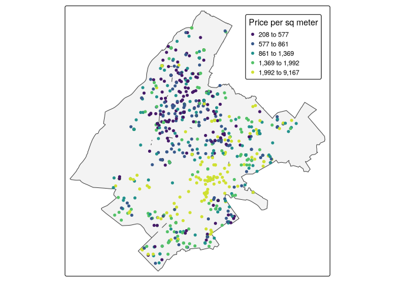
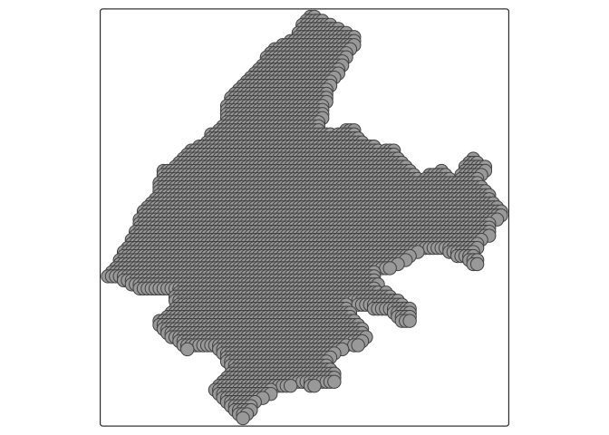
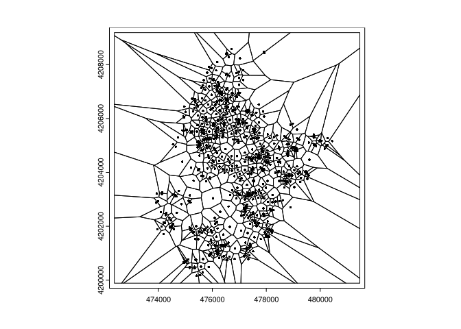
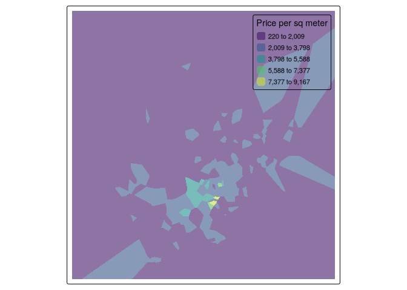
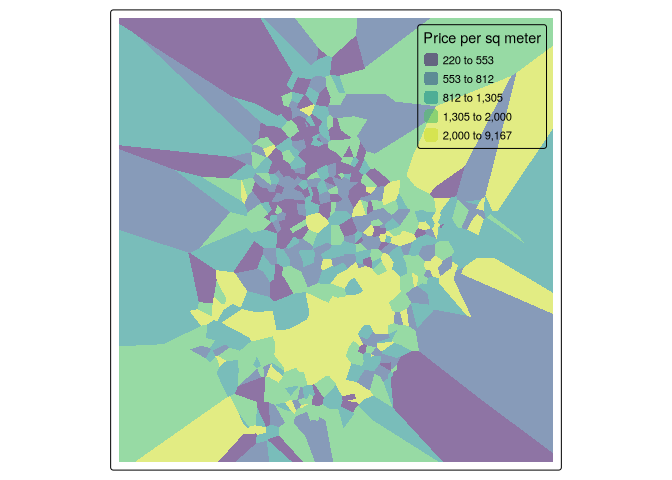
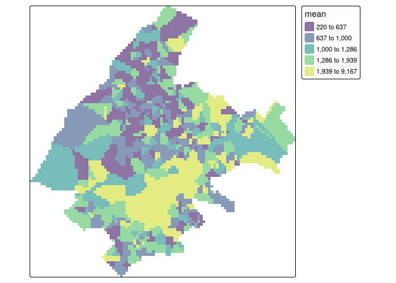
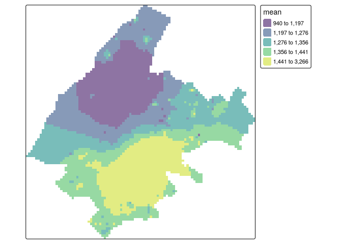
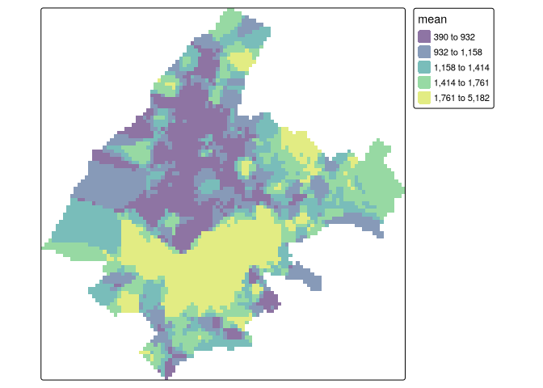
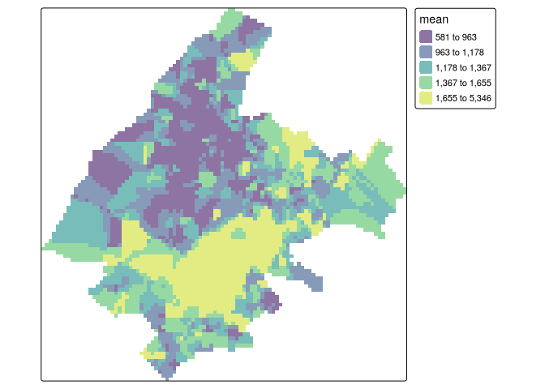

# 13-Spatial Interpolation Methods


``` r
library(spData)
library(sf)
library(terra)
library(spdep)
library(tmap)
library(viridis)
library(ggplot2)
```

# Spatial prediction of property prices

## Preparation

To illustrate the spatial interpolation methods, we use the properties
data of the spData package (Bivand, Nowosad, and Lovelace 2022) which
contains the price of apartments in Athens, Greece, in 2017. properties
is a sf object that contains several columns including price with the
apartments’ price in Euros, prpsqm with the apartments’ price per square
meter.

``` r
d <- properties
str(d)
```

    Classes 'sf' and 'data.frame':  1000 obs. of  7 variables:
     $ id        : chr  "7836" "7238" "368" "938" ...
     $ size      : int  74 77 85 85 102 150 70 35 100 71 ...
     $ price     : int  95000 165000 22000 225000 50000 500000 105000 8500 160000 31000 ...
     $ prpsqm    : num  1284 2143 259 2647 490 ...
     $ age       : num  47 10 42 51 37 37 1 47 11 57 ...
     $ dist_metro: num  623.87 509.47 862.13 5.46 312.35 ...
     $ geometry  :sfc_POINT of length 1000; first list element:  'XY' num  477144 4207786
     - attr(*, "sf_column")= chr "geometry"
     - attr(*, "agr")= Factor w/ 3 levels "constant","aggregate",..: NA NA NA NA NA NA
      ..- attr(*, "names")= chr [1:6] "id" "size" "price" "prpsqm" ...

``` r
d$vble <- d$prpsqm
```

The object depmunic contains the boundaries of the administrative
divisions of Athens.

``` r
str(depmunic)
```

    Classes 'sf' and 'data.frame':  7 obs. of  8 variables:
     $ num_dep   : int  1 2 3 4 5 6 7
     $ airbnb    : num  2171 721 524 144 231 ...
     $ museums   : num  17 1 0 0 0 0 0
     $ population: num  72962 102439 45168 84544 98283 ...
     $ pop_rest  : num  8202 5009 2735 4167 5099 ...
     $ greensp   : num  433582 478951 43312 40656 41369 ...
     $ area      : num  7.21 4.84 5.62 4.51 4.02 ...
     $ geometry  :sfc_POLYGON of length 7; first list element: List of 1
      ..$ : num [1:319, 1:2] 476648 476721 476725 476808 476822 ...
      ..- attr(*, "class")= chr [1:3] "XY" "POLYGON" "sfg"
     - attr(*, "sf_column")= chr "geometry"
     - attr(*, "agr")= Factor w/ 3 levels "constant","aggregate",..: NA NA NA NA NA NA NA
      ..- attr(*, "names")= chr [1:7] NA NA NA NA ...

``` r
map <- st_union(depmunic) %>% st_sf()
```

``` r
tmap_mode("plot")
```

    ℹ tmap mode set to "plot".

``` r
tm_shape(map) + 
  tm_polygons(fill_alpha = 0.3) +
  tm_shape(d) +
  tm_dots("vble", 
          tm_scale_intervals(n = 5, style = "quantile", values = "viridis"),
          fill.legend = tm_legend("Price per sq meter", 
                                  position = tm_pos_in("right", "top")))
```



Prediction locations

``` r
grid <- rast(map, nrows = 100, ncols = 100)
grid
```

    class       : SpatRaster 
    dimensions  : 100, 100, 1  (nrow, ncol, nlyr)
    resolution  : 91.04224, 92.98719  (x, y)
    extent      : 472365.2, 481469.4, 4199888, 4209186  (xmin, xmax, ymin, ymax)
    coord. ref. : GGRS87 / Greek Grid (EPSG:2100) 

``` r
xy <- xyFromCell(grid, 1:ncell(grid))
```

We create a sf object called coop with the prediction locations.

``` r
coop <- as.data.frame(xy) %>% 
  st_as_sf(coords = c("x", "y"), crs = st_crs(map)) %>% 
  st_filter(map)
qtm(coop)
```



## Closest observation

Using a voronoi plot.

``` r
v <- voronoi(x = vect(d), bnd = map)
plot(v)
points(vect(d), cex = 0.5)
```



Prediction

``` r
v <- st_as_sf(v)
tm_shape(v) +
  tm_fill("vble", 
          tm_scale_intervals(n = 5, style = "equal", values = "viridis"),
          fill.legend = tm_legend("Price per sq meter", 
                                  position = tm_pos_in("right", "top")),
          fill_alpha = 0.6)
```



``` r
tm_shape(v) +
  tm_fill("vble",
          tm_scale_intervals(n = 5, style = "quantile", values = "viridis"),
          fill.legend = tm_legend("Price per sq meter", 
                                  position = tm_pos_in("right", "top")),
          fill_alpha = 0.6)
```



Get predicted values at coop points

``` r
resp <- st_intersection(v, coop)
```

    Warning: attribute variables are assumed to be spatially constant throughout
    all geometries

``` r
resp$pred <- resp$vble

pred <- rasterize(resp, grid, field = "pred", fun = "mean")
tm_shape(pred) +
  tm_raster(col_alpha = 0.6, 
            col.scale = tm_scale_intervals(n = 5, style = "quantile",
                                           values = "viridis"))
```



## Inverse Distance Weighting (IDW)

We can apply the IDW method with the gstat() function of gstat and the
following arguments:

- formula: vble ~ 1 to have an intercept only model,
- nmax: number of neighbors is set equal to the total number of
  locations,
- idp: inverse distance power is set to idp = 1 to have weights with β=1

``` r
library(gstat)
res <- gstat(formula = vble ~ 1, locations = d,
             nmax = nrow(d),
             set = list(idp = 1))
resp <- predict(res, coop)
```

    [inverse distance weighted interpolation]

``` r
resp$x <- st_coordinates(resp)[,1]
resp$y <- st_coordinates(resp)[,2]
resp$pred <- resp$var1.pred

pred <- rasterize(resp, grid, field = "pred", fun = "mean")
tm_shape(pred) +
  tm_raster(col_alpha = 0.6, 
            col.scale = tm_scale_intervals(n = 5, style = "quantile",
                                           values = "viridis"))
```



## Nearest neighbors

Here, we consider the number of closest sampled locations equal to 5 by
setting nmax = 5. Unlike the IDW method, in the nearest neighbors
approach locations further away from the location where we wish to
predict are assigned the same weights. Therefore, the inverse distance
power idp is set equal to zero so all the neighbors are equally
weighted.

``` r
res <- gstat(formula = vble ~ 1, locations = d,
             nmax = 5, set = list(idp = 0))
resp <- predict(res, coop)
```

    [inverse distance weighted interpolation]

``` r
resp$x <- st_coordinates(resp)[,1]
resp$y <- st_coordinates(resp)[,2]
resp$pred <- resp$var1.pred

pred <- rasterize(resp, grid, field = "pred", fun = "mean")
tm_shape(pred) +
  tm_raster(col_alpha = 0.6, 
            col.scale = tm_scale_intervals(n = 5, style = "quantile",
                                           values = "viridis"))
```



# Ensemble

Closest observation (Voronoi)

``` r
v <- voronoi(x = vect(d), bnd = map) %>% 
  st_as_sf()
p1 <- st_intersection(v, coop)$vble
```

    Warning: attribute variables are assumed to be spatially constant throughout
    all geometries

IDW

``` r
gs <- gstat(formula = vble ~ 1, locations = d, 
            nmax = nrow(d),
            set = list(idp = 1))
p2 <- predict(gs, coop)$var1.pred
```

    [inverse distance weighted interpolation]

Nearest Neighbors

``` r
nn <- gstat(formula = vble ~ 1, locations = d, nmax = 5,
            set = list(idp = 0))
p3 <- predict(nn, coop)$var1.pred
```

    [inverse distance weighted interpolation]

Ensemble

``` r
weights <- c(1/3, 1/3, 1/3)
p4 <- p1 * weights[1] + p2 * weights[2] + p3 * weights[3]
```

``` r
resp <- data.frame(
  x = st_coordinates(coop)[,1],
  y = st_coordinates(coop)[,2],
  pred = p4
)
resp <- st_as_sf(resp, coords = c("x", "y"), crs = st_crs(map))

pred <- rasterize(resp, grid, field = "pred", fun = "mean")
tm_shape(pred) +
  tm_raster(col_alpha = 0.6, 
            col.scale = tm_scale_intervals(n = 5, style = "quantile",
                                           values = "viridis"))
```



## Cross-validation

``` r
set.seed(123)

RMSE <- function(observed, predicted) {
  sqrt(mean((observed - predicted)^2))
}

kf <- dismo::kfold(nrow(d), k = 5)

rmse_closest <- rep(NA, 5)
rmse_idw <- rep(NA, 5)
rmse_nn <- rep(NA, 5)
rmse_ensemble <- rep(NA, 5)

for(k in 1:5) {
  test <- d[kf == k, ]
  train <- d[kf != k, ]
  
  v <- voronoi(x = vect(train), bnd = map) %>% 
    st_as_sf()
  p1 <- st_intersection(v, test)$vble
  rmse_closest[k] <- RMSE(test$vbl, p1)
  
  gs <- gstat(formula = vble ~ 1, locations = train,
              nmax = nrow(train), set = list(idp = 1))
  p2 <- predict(gs, test)$var1.pred
  rmse_idw[k] <- RMSE(test$vble, p2)
  
  nn <- gstat(formula = vble ~ 1, locations = train,
            nmax = 5, set = list(idp = 0))
  p3 <- predict(nn, test)$var1.pred
  rmse_nn[k] <- RMSE(test$vble, p3)
  
  w <- 1/c(rmse_closest[k], rmse_idw[k], rmse_nn[k])
  weights <- w/sum(w)
  p4 <- p1 * weights[1] + p2 * weights[2] + p3 * weights[3]
  rmse_ensemble[k] <- RMSE(test$vble, p4)
}
```

    [inverse distance weighted interpolation]
    [inverse distance weighted interpolation]

    [inverse distance weighted interpolation]
    [inverse distance weighted interpolation]

    [inverse distance weighted interpolation]
    [inverse distance weighted interpolation]

    [inverse distance weighted interpolation]
    [inverse distance weighted interpolation]

    [inverse distance weighted interpolation]
    [inverse distance weighted interpolation]

``` r
cv <- data.frame(closest_obs = rmse_closest, IDW = rmse_idw,
           nearest_neig = rmse_nn, ensemble = rmse_ensemble)
cv
```

      closest_obs      IDW nearest_neig ensemble
    1    960.0305 855.0812     823.6701 747.3490
    2    836.7912 762.6661     723.4244 690.8201
    3   1038.5330 962.7646     867.8517 878.3099
    4   1003.1221 921.5928     872.3646 851.4582
    5    803.4875 844.1711     787.9071 730.5365

``` r
apply(cv, 1, mean)
```

    [1] 846.5327 753.4255 936.8648 912.1344 791.5255

``` r
cv <- data.frame(closest_obs = mean(rmse_closest), 
                 IDW = mean(rmse_idw),
                 nearest_neig = mean(rmse_nn), 
                 ensemble = mean(rmse_ensemble))
cv
```

      closest_obs      IDW nearest_neig ensemble
    1    928.3929 869.2552     815.0436 779.6947
