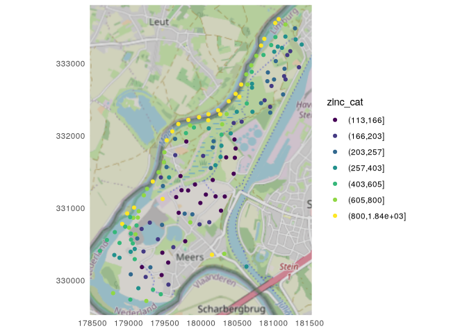
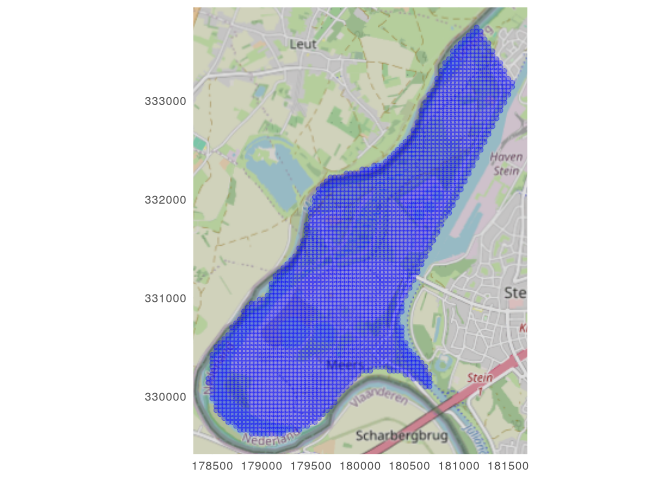
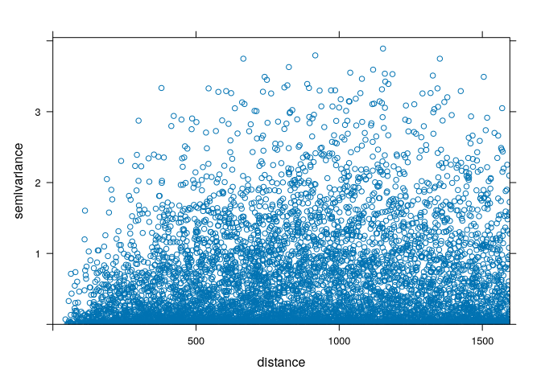
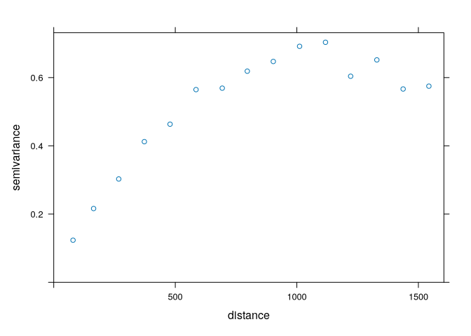
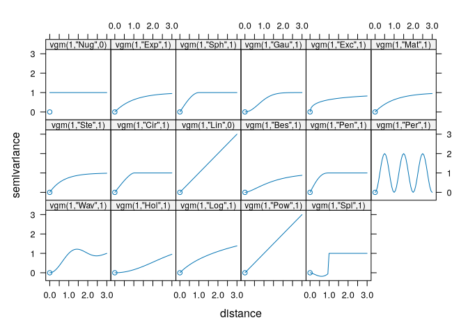
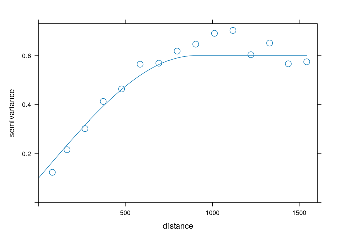
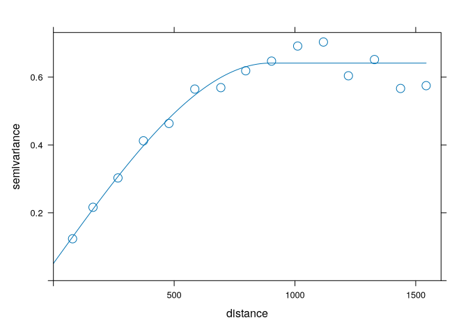
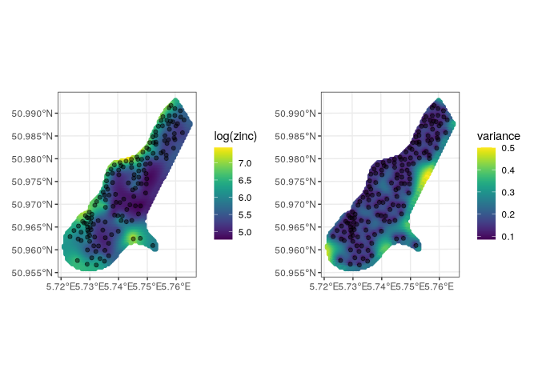

# Kriging - Zinc Concentrations


``` r
library(sp)
library(sf)
library(gstat)
library(mapview)
library(viridis)
library(ggplot2)
library(plotly)
```

# Predictions of zinc concentrations

## Data

``` r
data("meuse")
data("meuse.grid")
meuse <- st_as_sf(meuse, coords = c("x", "y"), crs = 28992)
meuse.grid <- st_as_sf(meuse.grid, coords = c("x", "y"),
                       crs = 28992)
```

``` r
breaks_m <- classInt::classIntervals(
  c(min(meuse$zinc) - .00001, meuse$zinc),
  n = 7, style = "quantile"
)
meuse$zinc_cat <- cut(meuse$zinc, breaks_m$brks)

ggplot(meuse, aes(color = zinc_cat)) +
    ggspatial::annotation_map_tile(      
    type = "osm",
    cachedir = "maps/",
    zoomin = -1) +
  geom_sf() +
  scale_color_viridis_d() +
  coord_sf(crs = st_crs(meuse), datum = st_crs(meuse)) +
  theme_minimal()
```

    Zoom: 13



``` r
ggplot(meuse.grid) +
    ggspatial::annotation_map_tile(      
    type = "osm",
    cachedir = "maps/",
    zoomin = -1) +
  geom_sf(color = "blue", alpha = 0.3) +
  coord_sf(crs = st_crs(meuse.grid), datum = st_crs(meuse.grid)) +
  theme_minimal()
```

    Zoom: 13



## Variogram cloud

The variogram cloud shows half of all possible squared differences of
data observation pairs against their separation distance h. The
variogram() function of gstat can be used to calculate the variogram
cloud. In variogram(), we set argument object to z ~ 1 if we wish to
obtain the variogram for data z, or to a formula of a linear model with
covariates if we wish the variogram for the residuals.

``` r
vc <- variogram(log(zinc) ~ 1, meuse, cloud = T)
plot(vc)
```



## Sample variogram

``` r
v <- variogram(log(zinc) ~ 1, meuse)
plot(v)
```



## Fitted variogram

``` r
vgm()
```

       short                                      long
    1    Nug                              Nug (nugget)
    2    Exp                         Exp (exponential)
    3    Sph                           Sph (spherical)
    4    Gau                            Gau (gaussian)
    5    Exc        Exclass (Exponential class/stable)
    6    Mat                              Mat (Matern)
    7    Ste Mat (Matern, M. Stein's parameterization)
    8    Cir                            Cir (circular)
    9    Lin                              Lin (linear)
    10   Bes                              Bes (bessel)
    11   Pen                      Pen (pentaspherical)
    12   Per                            Per (periodic)
    13   Wav                                Wav (wave)
    14   Hol                                Hol (hole)
    15   Log                         Log (logarithmic)
    16   Pow                               Pow (power)
    17   Spl                              Spl (spline)
    18   Leg                            Leg (Legendre)
    19   Err                   Err (Measurement error)
    20   Int                           Int (Intercept)

``` r
show.vgms(par.strip.text = list(cex = 0.75))
```



``` r
vinitial <- vgm(psill = 0.5, model = "Sph",
                range = 900, nugget = 0.1)
plot(v, vinitial, cutoff = 1000, cex = 1.5)
```



``` r
fv <- fit.variogram(object = v,
                    model = vgm(psill = 0.5, model = "Sph",
                                range = 900, nugget = 0.1))
fv
```

      model      psill    range
    1   Nug 0.05066017   0.0000
    2   Sph 0.59060556 897.0044

``` r
plot(v, fv, cex = 1.5)
```



## Kriging - predictions

``` r
k <- gstat(formula = log(zinc) ~ 1, data = meuse, model = fv)
kpred <- predict(k, meuse.grid)
```

    [using ordinary kriging]

``` r
library(patchwork)
p1 <- ggplot() +
  geom_sf(data = kpred, aes(color = var1.pred)) +
  geom_sf(data = meuse, alpha = 0.5) +
  scale_color_viridis(name = "log(zinc)") +
  theme_bw()

p2 <- ggplot() +
  geom_sf(data = kpred, aes(color = var1.var)) +
  geom_sf(data = meuse, alpha = 0.5) +
  scale_color_viridis(name = "variance") +
  theme_bw()

p1 + p2
```


