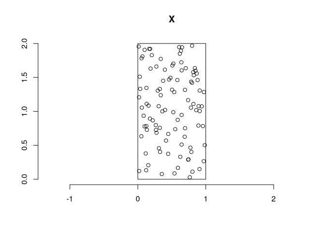
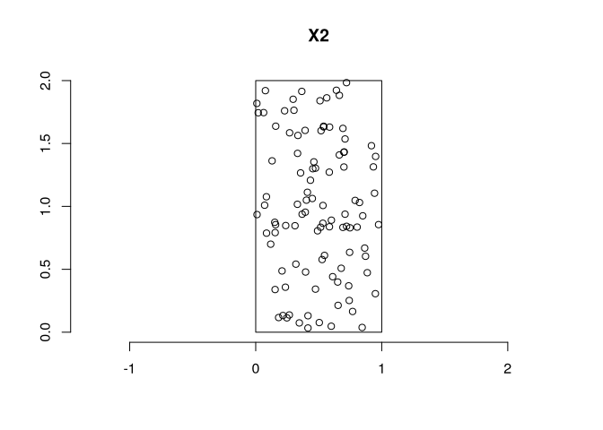
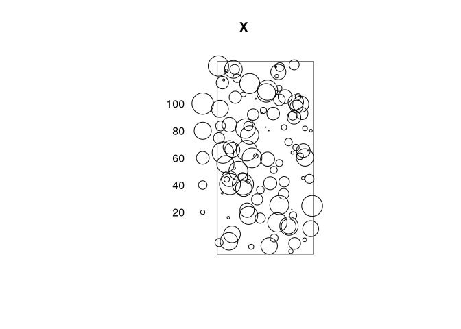
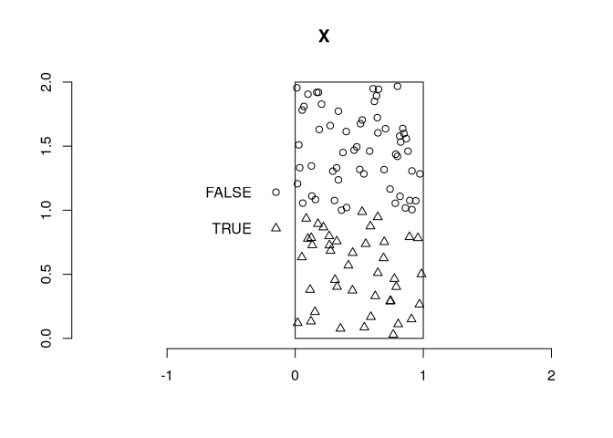
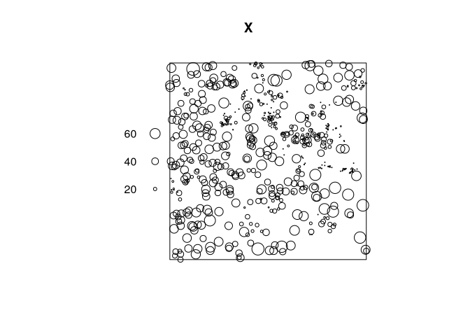
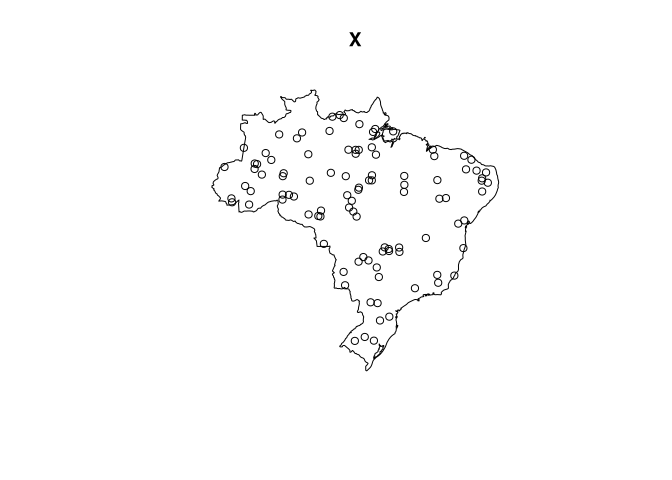

# spatstat package for spatial point patterns


``` r
library(spatstat)
library(sf)
library(rnaturalearth)
```

# Careating spatial point patterns

Create the observation window

``` r
win <- owin(xrange = c(0,1), yrange = c(0,2))
win; str(win)
```

    window: rectangle = [0, 1] x [0, 2] units

    List of 4
     $ type  : chr "rectangle"
     $ xrange: num [1:2] 0 1
     $ yrange: num [1:2] 0 2
     $ units :List of 3
      ..$ singular  : chr "unit"
      ..$ plural    : chr "units"
      ..$ multiplier: num 1
      ..- attr(*, "class")= chr "unitname"
     - attr(*, "class")= chr "owin"

``` r
plot(win)
```


Simulate 100 randome points in the window

``` r
x <- runif(100, 0, 1)
y <- runif(100, 0, 2)
X <- ppp(x = x, y = y, window = win)
X
```

    Planar point pattern: 100 points
    window: rectangle = [0, 1] x [0, 2] units

``` r
plot(X); axis(1); axis(2)
```



``` r
Window(X)
```

    window: rectangle = [0, 1] x [0, 2] units

Alternatively

``` r
X2 <- runifpoint(100, win)
plot(X2); axis(1); axis(2)
```



Adding associated information (marks)

Assign a numeric value to each event

Two alternatives:

``` r
marks(X) <- 1:npoints(X)
X <- X %mark% 1:npoints(X)
plot(X)
```



Test if points lie in a given window

``` r
win <- owin() # a unit window
marks(X) <- inside.owin(X, w = win)
plot(X); axis(1); axis(2)
```



# Converting between ppp and sf objects

## ppp to sf

Here, we show how to use the st_as_sf() function from sf to transform
the longleaf data from sptatstat which contains the locations and sizes
of longleaf pine trees, from ppp to sf class.

``` r
X <- longleaf
str(X)
```

    List of 6
     $ window    :List of 4
      ..$ type  : chr "rectangle"
      ..$ xrange: num [1:2] 0 200
      ..$ yrange: num [1:2] 0 200
      ..$ units :List of 3
      .. ..$ singular  : chr "metre"
      .. ..$ plural    : chr "metres"
      .. ..$ multiplier: num 1
      .. ..- attr(*, "class")= chr "unitname"
      ..- attr(*, "class")= chr "owin"
     $ n         : int 584
     $ x         : num [1:584] 200 199 194 168 184 ...
     $ y         : num [1:584] 8.8 10 22.4 35.6 45.4 47.2 48.8 42.1 29 33.6 ...
     $ markformat: chr "vector"
     $ marks     : num [1:584] 32.9 53.5 68 17.7 36.9 51.6 66.4 17.7 21.9 25.7 ...
     - attr(*, "class")= chr "ppp"

``` r
plot(X)
```


``` r
d <- data.frame(x = X$x, y = X$y, m = marks(X)) %>% 
  st_as_sf(coords = c("x", "y"))
```

## sf to ppp

``` r
X <- as.ppp(st_coordinates(d), st_bbox(d))
X <- X %mark% d$m
plot(X)
```



Here, we show an example on how to create a spatial point pattern with
the boundary of Brazil as observation window.

``` r
map <- ne_countries(type = "countries", country = "Brazil",
                    scale = "medium", returnclass = "sf") %>% 
  st_transform(crs = "EPSG:29172")
win <- as.owin(map)
X <- runifpoint(100, win = win)
plot(X)
```


