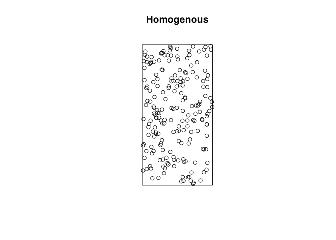
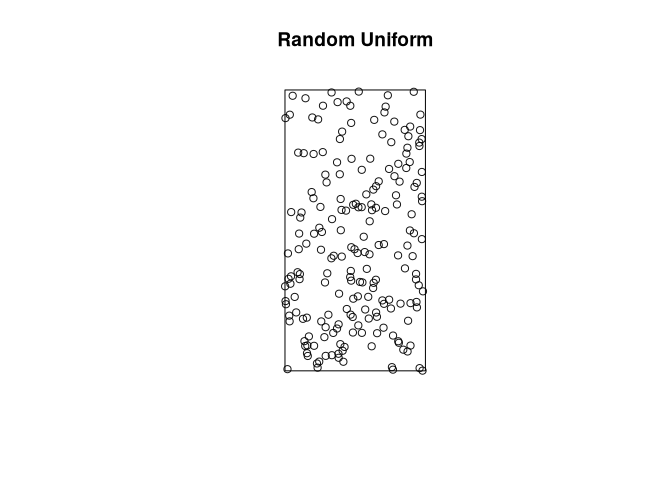
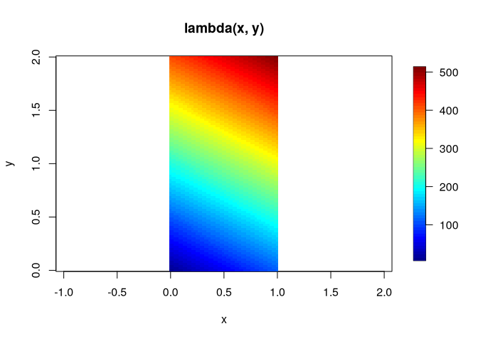
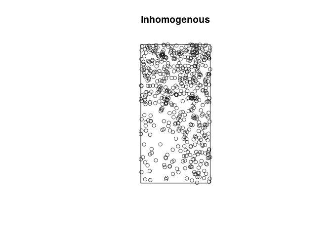

# Spatial Point Processes and Simulation


``` r
library(spatstat)
library(fields)
```

# Spatial point processes

Spatial point processes are stationary if the do not change under
translation and isotropic if its statistical properties do not change
under rotation

For a stationary, isotropic spp, the intensity function is

$$
\lambda(\boldsymbol{x}) = \lambda = \frac{E[N(A)]}{|A|}
$$

The second-order intnsity reduces to a function of distance

$$
\lambda_2(\boldsymbol{x}, \boldsymbol{y}) = \lambda_2(||\boldsymbol{x} - \boldsymbol{y}||)=\lambda_2(h)
$$

where $h =||\boldsymbol{x}-\boldsymbol{y}||$ is the distance between $x$
and $y$. The covariance density is

$$
\gamma(\boldsymbol{x}, \boldsymbol{y}) =\gamma(h)=\lambda_2(h)-\lambda^2
$$

# Poisson processes

Characteristics:

1.  Number of events in any region follows a Poisson distribution with
    mean

$$
\mu(A) = \int_A \lambda(\boldsymbol{x}) d\boldsymbol{x}
$$

and

$$
P(N(A) = n) = exp(-\mu(A))\frac{\mu(A)^n}{n!}
$$

2.  Given $N(A)=n$, the locations of the n events in A form an
    independent random sample from the distribution on $A$ with
    probability density function proportional to the intensity
    $\lambda(⋅)$.

Poisson processes are either homogenous (aka complete spatial randomness
or CSR), with constant intensity, or inhomogenous if the intensity
varies in space.

# Simulating Poisson point patterns

## Homogenous point process

``` r
phom <- rpoispp(lambda = 100,
                win = owin(xrange = c(0, 1), yrange = c(0, 2)))
phom$n
```

    [1] 202

``` r
plot(phom, main = "Homogenous")
```



``` r
punif <- runifpoint(n = 200,
                    win = owin(xrange = c(0, 1), yrange = c(0, 2)))
punif$n
```

    [1] 200

``` r
plot(punif, main = "Random Uniform")
```



## Inhomogenous point process

``` r
lambda <- function(x) {(10 + 100 * x[1] + 200 * x[2])}
xseq <- seq(0, 1, length.out = 50)
yseq <- seq(0, 2, length.out = 100)
grid <- expand.grid(xseq, yseq)

z <- apply(grid, 1, lambda)

zmat <- matrix(z, 50, 100)
image.plot(xseq, yseq, zmat, xlab = "x", ylab = "y",
           main = "lambda(x, y)", asp = 1)
```



``` r
fnintensity <- function(x, y){10 + 100 * x + 200 * y}
pinhom <- rpoispp(lambda = fnintensity,
                  win = owin(xrange = c(0, 1), yrange = c(0, 2)))
pinhom$n
```

    [1] 522

``` r
plot(pinhom, main = "Inhomogenous")
```


