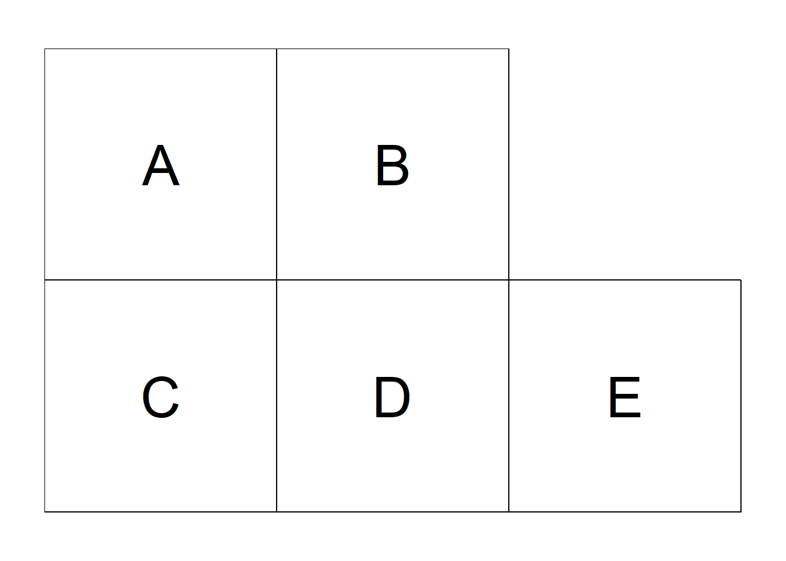
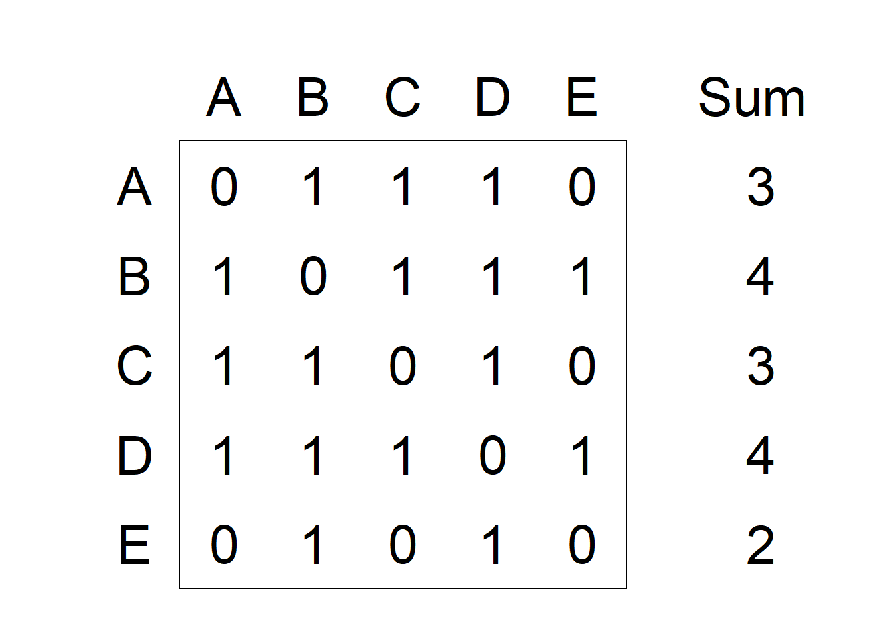

```{r setup, include=FALSE}
knitr::opts_chunk$set(echo = TRUE, paged.print = FALSE)
```

# Spatial neighborhood matrices

```{r}
library(spData)
library(sf)
library(spdep)
library(ggplot2)
```

```{r}
data("columbus")
map <- st_read(system.file("shapes/columbus.gpkg", package = "spData")[1],
               quiet = TRUE) |> 
  st_set_crs(4326) |> 
  st_transform(crs = 3857)
```

## Neighbors based on contiguity

```{r}
nb <- poly2nb(map, queen = TRUE)
head(nb)
```

```{r}
plot(st_geometry(map), border = "lightgray")
plot.nb(nb, st_geometry(map), add = TRUE)
```

> Plot neighbors of given area

```{r}
id <- 20
map$neighbors <- "other"
map$neighbors[id] <- "area"
map$neighbors[nb[[id]]] <- "neighbors"
```

```{r}
ggplot(map) +
  geom_sf(aes(fill = neighbors)) +
  theme_bw() +
  scale_fill_manual(values = c("gray30", "gray", "white"))
```

## K Nearest Neighbors

> Neighbors based on 3 nearest

```{r warning=FALSE}
coo <- st_centroid(map)
nb <- knn2nb(knearneigh(coo, k = 3))
plot(st_geometry(map), border = "lightgrey")
plot.nb(nb, st_geometry(map), add = TRUE)
```

## Neighbors based on distance

```{r}
st_crs(map)
```

```{r, warning=FALSE}
nb <- dnearneigh(x = st_centroid(map), d1 = 0, d2 = 70000)
plot(st_geometry(map), border = "lightgray")
plot.nb(nb, st_geometry(map), add = TRUE)
```

> determine appropriate upper bound to ensure all are connected

```{r}
coo <- st_centroid(map)
nb1 <- knn2nb(knearneigh(coo, k = 1))
dist1 <- nbdists(nb1, coo)
summary(unlist(dist1))
```

## Order-k based

```{r}
nb <- poly2nb(map, queen = TRUE)
nblags <- nblag(neighbours = nb, maxlag = 2)
```

> First order

```{r}
plot(st_geometry(map), border = "lightgray")
plot.nb(nblags[[1]], st_geometry(map), add = TRUE)
```

> Second order

```{r}
plot(st_geometry(map), border = "lightgray")
plot.nb(nblags[[2]], st_geometry(map), add = TRUE)
```

```{r}
nb <- poly2nb(map, queen = TRUE)
nblagsc <- nblag_cumul(nblags)
plot(st_geometry(map), border = "lightgray")
plot.nb(nblagsc, st_geometry(map), add = TRUE)
```

## Neighborhood matrices

{width="300"}

{width="300"}

### Spatial weights based on binary neighbor list

> `nb2listw()`
>
> -   `nb` list with neighbors,
> -   `style` indicates the coding scheme chosen. For example, `style =` `B` is the basic binary coding, and `W` is row standardized (1/number of neighbors),
> -   `zero.policy` is used to take into account regions with 0 neighbors. Specifically, `zero.policy = TRUE` permits the weight list to contain zero-length weights vectors, and
>     `zero.policy = FALSE` stops the function with an error if there are empty neighbor sets.

```{r}
nb <- poly2nb(map, queen = TRUE)
nbw <- nb2listw(nb, style = "W")
nbw$weights[1:5]
```

```{r}
m1 <- listw2mat(nbw)
lattice::levelplot(
  t(m1),
  scales = list(y = list(at = c(10, 20, 30, 40),
                labels = c(10, 20, 30, 40))))
```

#### Spatial weights matrix based on inverse distance

Given a list of neighbors, we can use [`nbdists()`](https://r-spatial.github.io/spdep/reference/nbdists.html) to compute the distances along the links. Then, we can construct the list with spatial weights based on inverse distance values using [`nb2listw()`](https://r-spatial.github.io/spdep/reference/nb2listw.html) where the argument `glist` is equal to a list of general weights corresponding to neighbors.

```{r}
coo <- st_centroid(map)
nb <- poly2nb(map, queen = T)
dists <- nbdists(nb, coo)
ids <- lapply(dists, function(x) {1 / x})
```

```{r}
nbw <- nb2listw(nb, glist = ids, style = "B")
nbw$weights[1:3]
```

```{r}
m2 <- listw2mat(nbw)
lattice::levelplot(
  t(m2),
  scales = list(y = list(at = c(10, 20, 30, 40),
                         labels = c(10, 20, 30, 40)))
)
```
