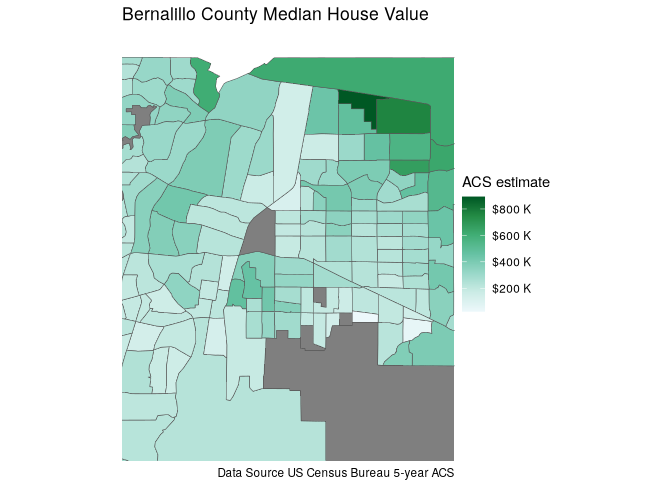
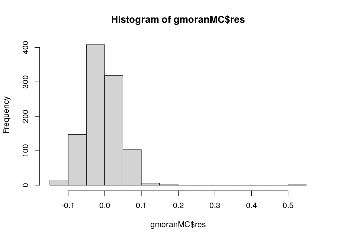
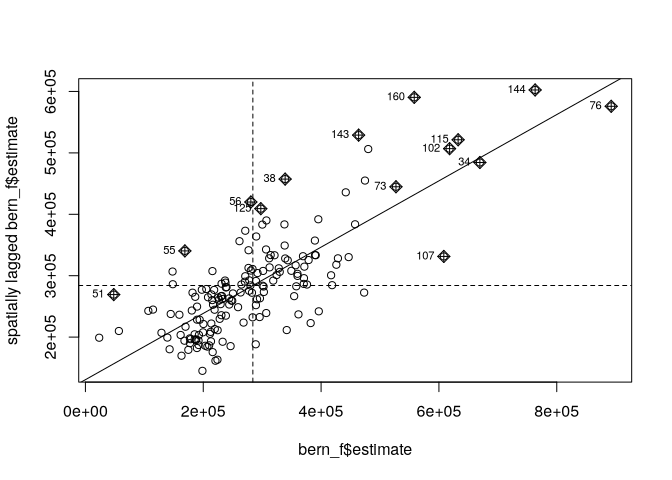
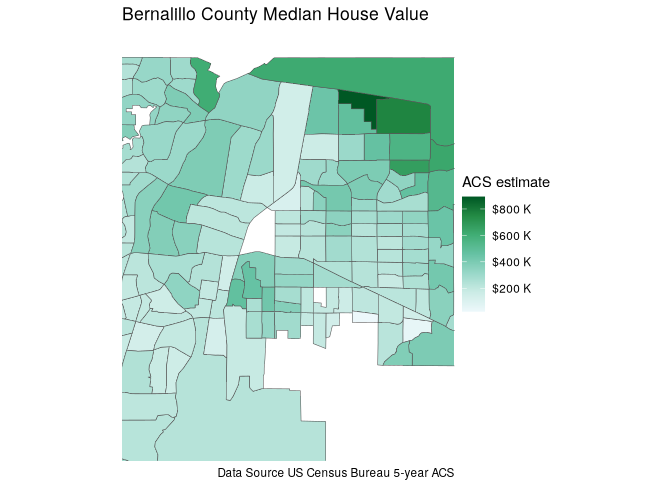
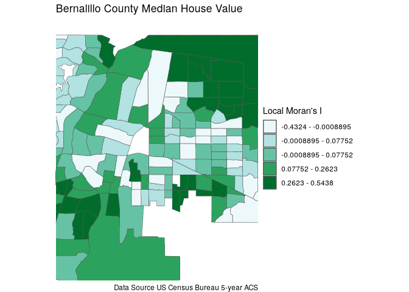
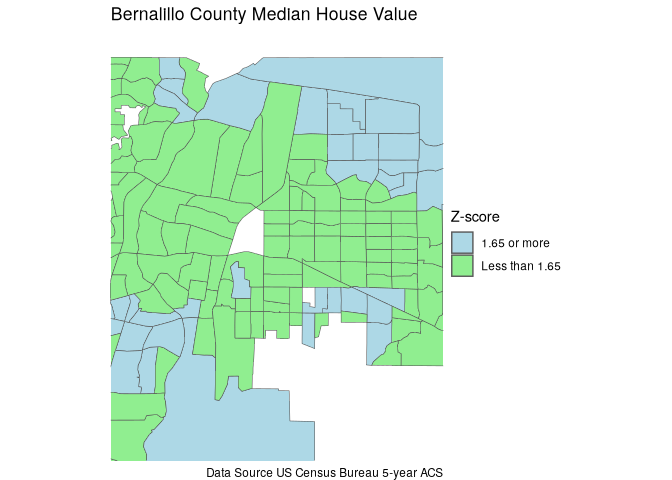
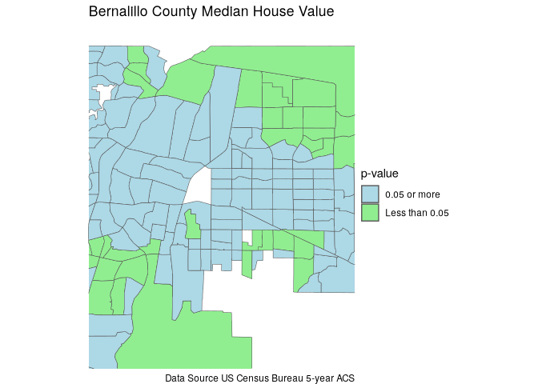
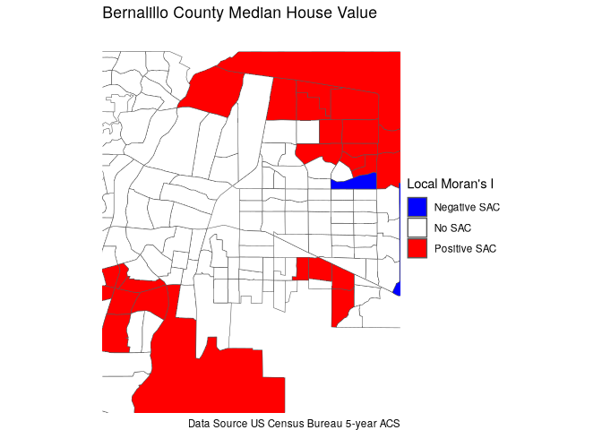
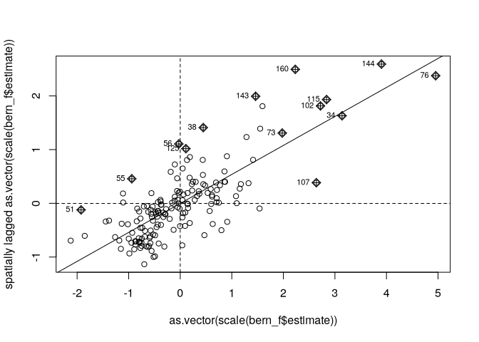
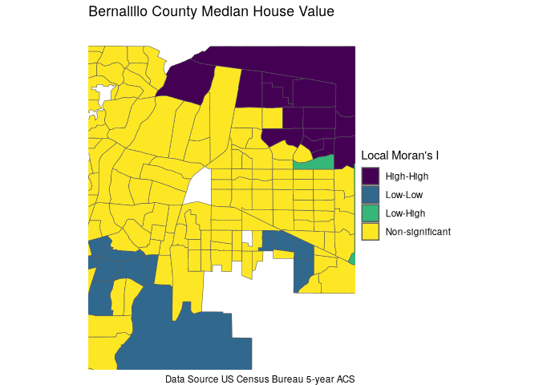

# Bernalillo County Spatial Autocorrelation Housing Value


# Albuquerque Housing Values

``` r
library(tidycensus)
library(ggplot2)
library(dplyr)
library(sf)
library(spdep)
library(scales)
library(leaflet)
options(tigris_use_cache = TRUE)
```

``` r
api_key <- Sys.getenv("CENSUS_API_KEY")
```

``` r
bern <- get_acs(
  geography = "tract", 
  variables = "B25077_001", 
  state = "NM", 
  county = "Bernalillo",
  year = 2023,
  geometry = TRUE
)
```

    Getting data from the 2019-2023 5-year ACS

``` r
ggplot(bern, aes(fill = estimate)) +
  geom_sf() +
  labs(title = "Bernalillo County Median House Value", 
       caption = "Data Source US Census Bureau 5-year ACS", 
       fill = "ACS estimate") +
  coord_sf(xlim = c(-106.7, -106.49), ylim = c(35.0, 35.225)) +
  scale_fill_distiller(palette = "BuGn",
                       direction = 1,
                       labels = unit_format(unit = "K", scale = 1e-3,
                                            prefix = "$")) + 
  theme_void()
```



``` r
summary(bern$estimate)
```

       Min. 1st Qu.  Median    Mean 3rd Qu.    Max.    NA's 
      23400  207550  264800  284198  338600  892400       9 

``` r
pal <- colorNumeric(palette = "Greens",
                    domain = bern$estimate)
bbb <- st_bbox(bern)
```

``` r
leaflet(bern %>% st_transform(4326)) |> 
  addTiles() |> 
  addPolygons(
      stroke = F,
      fillOpacity = 0.75,
      color = ~pal(bern$estimate),
      label = ~paste0("Med. Val. (dollars): ", prettyNum(estimate, big.mark = ","))
  ) |> 
  addLegend("bottomright", pal = pal, values = ~estimate,
    title = "Est. Med. House Value 2023",
    labFormat = labelFormat(prefix = "$", transform = function(x){x/1000}, suffix = "K"),
    opacity = 1
  ) |> 
  fitBounds(-106.7, 35, -106.49, 35.225) |> 
  addMiniMap(tiles = providers$Esri.WorldStreetMap)
```

``` r
bern_f <- bern |> filter(complete.cases(estimate))
nb <- poly2nb(bern_f, queen = TRUE)
nbw <- nb2listw(nb, style = "W")

gmoran <- moran.test(bern_f$estimate, nbw,
                     alternative = "greater")
gmoran
```


        Moran I test under randomisation

    data:  bern_f$estimate  
    weights: nbw    

    Moran I statistic standard deviate = 12.387, p-value < 2.2e-16
    alternative hypothesis: greater
    sample estimates:
    Moran I statistic       Expectation          Variance 
          0.539750944      -0.006024096       0.001941260 

``` r
gmoranMC <- moran.mc(bern_f$estimate, nbw, nsim = 999)
gmoranMC
```


        Monte-Carlo simulation of Moran I

    data:  bern_f$estimate 
    weights: nbw  
    number of simulations + 1: 1000 

    statistic = 0.53975, observed rank = 1000, p-value = 0.001
    alternative hypothesis: greater

``` r
hist(gmoranMC$res)
```



``` r
moran.plot(bern_f$estimate, nbw)
```



## Local Moran

``` r
lmoran <- localmoran(bern_f$estimate, nbw, 
                     alternative = "greater")
head(lmoran)
```

                 Ii          E.Ii      Var.Ii        Z.Ii Pr(z > E(Ii))
    1 -0.0169464194 -0.0074250445 0.198913212 -0.02134852    0.50851618
    2 -0.0006222079 -0.0001121497 0.003654582 -0.00843725    0.50336594
    3  0.0767626779 -0.0010745399 0.021456320  0.53138548    0.29757584
    4  0.1217812478 -0.0038453279 0.124838504  0.35555537    0.36108679
    5  0.2924396507 -0.0019981483 0.045844864  1.37514413    0.08454338
    6  0.0587008671 -0.0004924511 0.027067496  0.35978963    0.35950223

``` r
bern_f$lmI <- lmoran[, "Ii"] # local Moran's I
bern_f$lmZ <- lmoran[, "Z.Ii"] # z-scores
# p-values corresponding to alternative greater
bern_f$lmp <- lmoran[, "Pr(z > E(Ii))"]
```

``` r
ggplot(bern_f, aes(fill = estimate)) +
  geom_sf() +
  labs(title = "Bernalillo County Median House Value", 
       caption = "Data Source US Census Bureau 5-year ACS", 
       fill = "ACS estimate") +
  coord_sf(xlim = c(-106.7, -106.49), ylim = c(35.0, 35.225)) +
  scale_fill_distiller(palette = "BuGn",
                       direction = 1,
                       labels = unit_format(unit = "K", scale = 1e-3,
                                            prefix = "$")) + 
  theme_void()
```



``` r
library(classInt)
breaks_lmI <- classIntervals(c(min(bern_f$lmI) - .00001,
                              bern_f$lmI), n = 5, style = "quantile")
breaks_lmI$brks
```

    [1] -0.4324114771 -0.0008895275  0.0775210285  0.2622666668  0.5438364827
    [6] 11.8373595713

``` r
library(stringr)
library(purrr)
```


    Attaching package: 'purrr'

    The following object is masked from 'package:scales':

        discard

``` r
library(readr)
```


    Attaching package: 'readr'

    The following object is masked from 'package:scales':

        col_factor

``` r
bern_lmI <- mutate(bern_f, 
                   lmIcat = cut(bern_f$lmI, breaks_lmI$brks, 
                                dig.lab = 4))
ranges <- bern_lmI$lmIcat %>% 
  as.character()
labels <- map(ranges, 
              \(x) str_match(x, "(\\-?\\d+\\.\\d+).*(\\d+\\.\\d+)"))

labels <- map_chr(labels, \(x) x[1])
labels <- map_chr(labels, \(x) str_replace(x, ",", " - "))
bern_f$labels <-labels
```

``` r
ggplot(bern_lmI) +
  geom_sf(aes(fill = lmIcat)) +
  labs(title = "Bernalillo County Median House Value", 
       caption = "Data Source US Census Bureau 5-year ACS", 
       fill = "Local Moran's I") +
  scale_fill_brewer(labels = labels, palette = "BuGn") +
  coord_sf(xlim = c(-106.7, -106.49), ylim = c(35.0, 35.225)) +
  theme(legend.position = "right") +
  theme_void()
```



``` r
bern_f <- mutate(
  bern_f,
  zcat = ifelse(lmZ < 1.65, "Less than 1.65", "1.65 or more"))
ggplot(bern_f, aes(fill = zcat)) +
  geom_sf() +
  labs(title = "Bernalillo County Median House Value", 
       caption = "Data Source US Census Bureau 5-year ACS", 
       fill = "Z-score") +
  coord_sf(xlim = c(-106.7, -106.49), ylim = c(35.0, 35.225)) +
  scale_fill_manual(values = c("lightblue", "lightgreen")) + 
  theme_void()
```



``` r
bern_f <- mutate(
  bern_f,
  pcat = ifelse(lmp < 0.05, "Less than 0.05", "0.05 or more"))
ggplot(bern_f, aes(fill = pcat)) +
  geom_sf() +
  labs(title = "Bernalillo County Median House Value", 
       caption = "Data Source US Census Bureau 5-year ACS", 
       fill = "p-value") +
  coord_sf(xlim = c(-106.7, -106.49), ylim = c(35.0, 35.225)) +
  scale_fill_manual(values = c("lightblue", "lightgreen")) + 
  theme_void()
```



In this two-sided test, z-score values lower than –1.96 indicate
negative spatial autocorrelation, and z-score values greater than 1.96
indicate positive spatial autocorrelation.

``` r
bern_f <- bern_f %>% mutate(
  SAC = case_when(lmZ < -1.96 ~ "Negative SAC",
                  lmZ >= -1.96 & lmZ <= 1.96 ~ "No SAC",
                  TRUE ~ "Positive SAC")
)
```

``` r
ggplot(bern_f, aes(fill = SAC)) +
  geom_sf() +
  labs(title = "Bernalillo County Median House Value", 
       caption = "Data Source US Census Bureau 5-year ACS", 
       fill = "Local Moran's I") +
  coord_sf(xlim = c(-106.7, -106.49), ylim = c(35.0, 35.225)) +
  scale_fill_manual(values = c("blue", "white", "red")) + 
  theme_void()
```



# Clusters

``` r
lmoran <- localmoran(bern_f$estimate, nbw,
                     alternative = "two.sided")
head(lmoran)
```

                 Ii          E.Ii      Var.Ii        Z.Ii Pr(z != E(Ii))
    1 -0.0169464194 -0.0074250445 0.198913212 -0.02134852      0.9829676
    2 -0.0006222079 -0.0001121497 0.003654582 -0.00843725      0.9932681
    3  0.0767626779 -0.0010745399 0.021456320  0.53138548      0.5951517
    4  0.1217812478 -0.0038453279 0.124838504  0.35555537      0.7221736
    5  0.2924396507 -0.0019981483 0.045844864  1.37514413      0.1690868
    6  0.0587008671 -0.0004924511 0.027067496  0.35978963      0.7190045

``` r
bern_f$lmp <- lmoran[, 5]
mp <- moran.plot(as.vector(scale(bern_f$estimate)), nbw)
```



``` r
head(mp)
```

               x           wx is_inf labels       dfb.1_        dfb.x        dffit
    1 -1.1068770  0.015218442  FALSE      1  0.111147185 -0.123396273  0.166073288
    2  0.1360344 -0.004546511  FALSE      2 -0.013662970 -0.001864224 -0.013789564
    3 -0.4210766 -0.181209355  FALSE      3  0.008494936 -0.003587777  0.009221501
    4 -0.7965564 -0.151969171  FALSE      4  0.050145681 -0.040063996  0.064184991
    5 -0.5742007 -0.506248975  FALSE      5 -0.034881698  0.020089333 -0.040253126
    6 -0.2850568 -0.204693812  FALSE      6 -0.008819816  0.002521710 -0.009173232
         cov.r       cook.d         hat
    1 1.000947 1.370417e-02 0.013368607
    2 1.018060 9.563770e-05 0.006099502
    3 1.019277 4.277418e-05 0.007056129
    4 1.017097 2.067175e-03 0.009810326
    5 1.017865 8.140964e-04 0.007974207
    6 1.018671 4.232731e-05 0.006477526

``` r
bern_f$quadrant <- NA
bern_f[(mp$x >= 0 & mp$wx >= 0) & 
         (bern_f$lmp <= 0.05), 
       "quadrant"] <- 1
bern_f[(mp$x <= 0 & mp$wx <= 0) & (bern_f$lmp <= 0.05), 
       "quadrant"]<- 2
# high-low
bern_f[(mp$x >= 0 & mp$wx <= 0) & (bern_f$lmp <= 0.05), 
       "quadrant"]<- 3
# low-high
bern_f[(mp$x <= 0 & mp$wx >= 0) & (bern_f$lmp <= 0.05), 
       "quadrant"]<- 4
# non-significant
bern_f[(bern_f$lmp > 0.05), "quadrant"] <- 5

bern_f <- bern_f %>% 
  mutate(
    quad_labs = case_when(
      quadrant == 1 ~ "High-High",
      quadrant == 2 ~ "Low-Low",
      quadrant == 3 ~ "High-Low",
      quadrant == 4 ~ "Low-High",
      TRUE ~ "Non-significant"
    )
  )
bern_f[, c("quadrant","quad_labs")]
```

    Simple feature collection with 167 features and 2 fields
    Geometry type: POLYGON
    Dimension:     XY
    Bounding box:  xmin: -107.1972 ymin: 34.86928 xmax: -106.1497 ymax: 35.21946
    Geodetic CRS:  NAD83
    First 10 features:
       quadrant       quad_labs                       geometry
    1         5 Non-significant POLYGON ((-106.6433 35.0903...
    2         5 Non-significant POLYGON ((-106.6399 35.1461...
    3         5 Non-significant POLYGON ((-106.5864 35.1232...
    4         5 Non-significant POLYGON ((-106.6042 35.1092...
    5         5 Non-significant POLYGON ((-106.6498 35.0699...
    6         5 Non-significant POLYGON ((-106.7155 35.1527...
    7         5 Non-significant POLYGON ((-106.5329 35.1017...
    8         5 Non-significant POLYGON ((-106.7492 35.0932...
    9         5 Non-significant POLYGON ((-106.5862 35.0729...
    10        2         Low-Low POLYGON ((-106.7106 35.0799...

``` r
bern_f$quad_labs <- factor(bern_f$quad_labs,
       levels = c("High-High", "Low-Low", "High-Low",
                  "Low-High", "Non-significant"))
```

``` r
ggplot(bern_f, aes(fill = quad_labs)) +
  geom_sf() +
  labs(title = "Bernalillo County Median House Value", 
       caption = "Data Source US Census Bureau 5-year ACS", 
       fill = "Local Moran's I") +
  coord_sf(xlim = c(-106.7, -106.49), ylim = c(35.0, 35.225)) +
  scale_fill_viridis_d() +
  theme_void()
```


